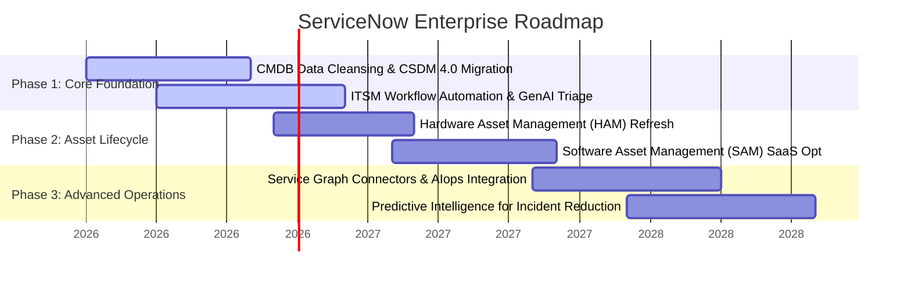

# Executive ServiceNow Portfolio

## Platform Leader | ITSM, Asset Management & CMDB Governance

Highly accomplished ServiceNow Executive with a proven track record of transforming IT operations through data-driven CMDB design, optimized Asset Management (HAM/SAM), and mature ITSM frameworks. Expert at aligning platform capabilities with enterprise business strategy to drive automation, mitigate compliance risks, and reduce technical debt.

---

## 📊 Strategic Impact Metrics

| 🛠️ ITSM Maturity | 📉 Asset Compliance | 🗃️ CMDB Data Integrity |
| :--- | :--- | :--- |
| **35% Reduction** in MTTR via Automated Triage | **$1.8M Saved** in Software Audit Exposure | **98% Attestation Rate** for Critical CIs |
| **94% CSAT** across 50k+ Enterprise Users | **100% Lifecycle Tracking** Hardware Assets | **Real-time Mapping** of Business Services |

---

## 🗺️ 3-Year Strategic Platform Roadmap
This operational roadmap highlights my strategic rollout plan for a mature, unified platform footprint.

---

## 📂 Director Portfolio Sections
*   [Platform Governance & Roadmap Framework](governance.md)
*   [Enterprise Implementation Case Studies](case-studies.md)
*   [Technical Templates & Instance Hardening Checklists](hardening-checklist.md)
