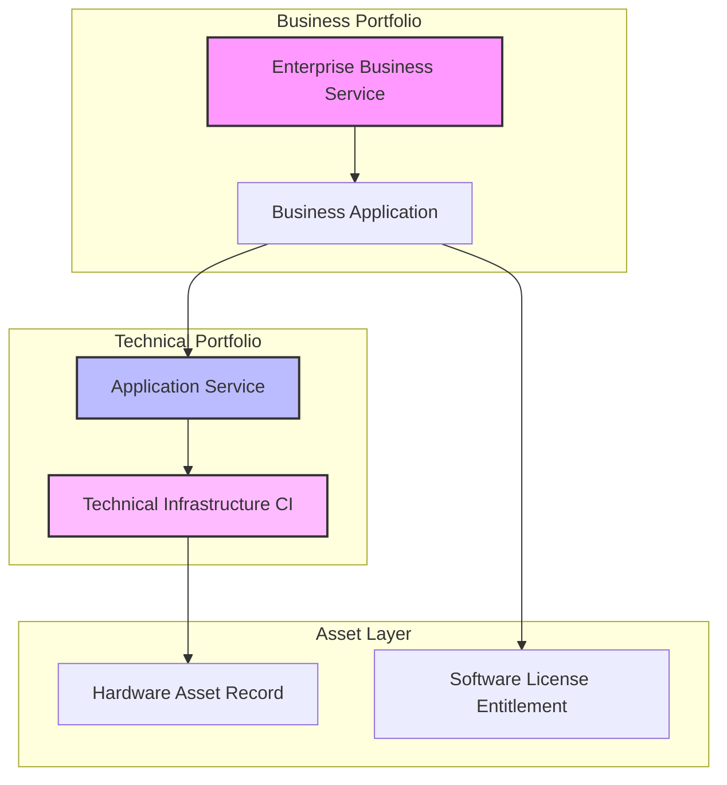

# Platform Governance & Architecture Framework

## 🏢 Center of Excellence and Innovation (CoEI)
A sustainable platform requires strict intake management. My governance model ensures that every configuration aligns with out-of-the-box (OOTB) standards to safeguard upgrade paths.

### Demand Management Matrix
1. **Strategic Alignment Triage**: Run all customization requests through an architecture review board (ARB).
2. **Technical Debt Cap**: Limit custom script includes and client scripts; prioritize Flow Designer and Integration Hub.
3. **Upgrade Readiness SLA**: Maintain instance health index scores above 90% via automated HealthScan integration.

---

## 🗺️ Configuration Common Services Data Model (CSDM 4.0)
To maximize the value of both ITSM and Asset Management, the CMDB must be services-aware. Below is the structural framework I utilize to map infrastructure to business outcomes.

